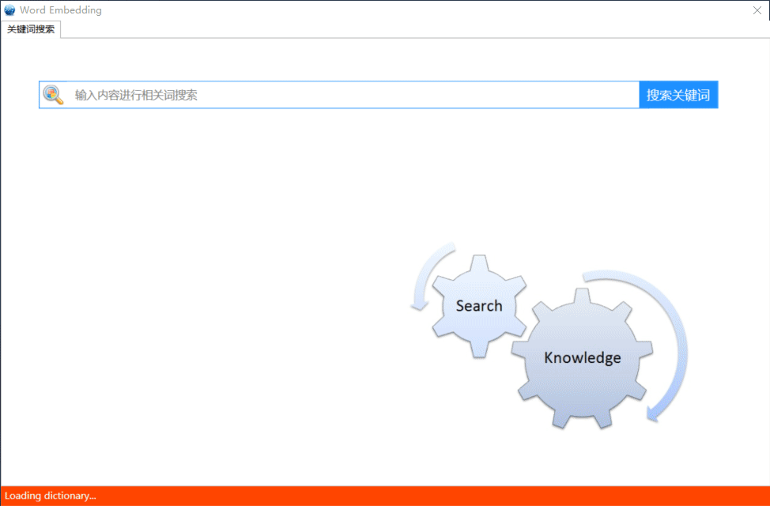
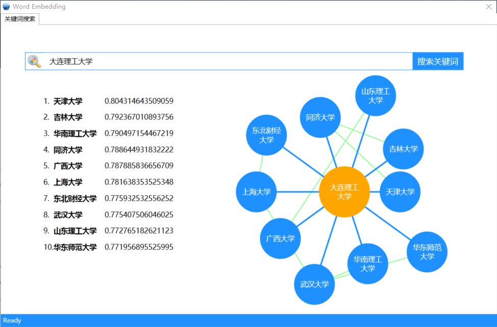

# VisualWordEmbedding
词向量可视化工具

## 下载与执行
1. 下载编译好的可执行文件 [点击下载](resources/VisualWordEmbedding.zip)
2. 下载预训练好的词向量文件 
3. 将词向量文件重命名为wordemb.vec放在与WordGraph.exe文件同级目录中

## 操作演示
- 载入词向量文件的时间可能较长，请耐心等待。

## 词向量效果对比
### 1. Word2Vec

### 2. FastText

可以看出FastText与Word2Vec相比，对词语内部的字级别n-gram的信息利用更多（理工大学）。

### 3. Glove

Glove与Word2Vec相比，更关注了共现次数的信息。
